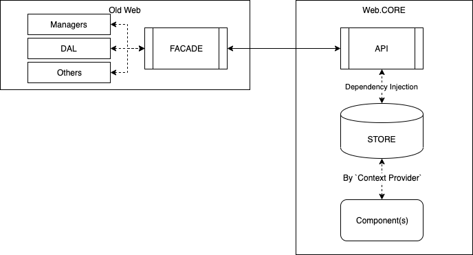

# Adding a new Component

To give a very plain view of the basic architecture of the app, it looks like this:



Where:
**Old Web** - existing implementation of the web app
**Web.CORE** - new app

## Facade

The `Facade` is a way to expose component dependencies in `Old Web` to the new app. It's a plain require module that returns an object exposing these dependencies: `DAL(s)`, `Managers`, `StateObject` & other APIs (`BuilderForInBetweenQuote`, `Dictionary` etc.).

```js
define(`Store`, [
  `Customer`,
  `Dictonary`,
  `dalDemoAccount`,
  /*
   * other modules
   */
  "StoreAPI", // this is the CORE module exposed as an AMD module
], function() {
  var Customer = require("Customer"),
    Dictionary = require("Dictionary"),
    dalDemoAccount = require("dalDemoAccount");

  var StoreAPI = require("StoreAPI");

  var Facade = {
    Customer,
    Dictionary,
    dalDemoAccount,
  };

  // we pass this facade to the StoreAPI
  var store = StoreAPI.createStore({}, Facade);

  // we do other stuff in between but the basic of it is above
  // we then return the store & other methods from the API
});
```

## API

The `API` wraps the `Facade` and has methods for working with `Old Web` code

Eg `customerApi`:

```ts
const getCustomerData = (customer: IWebCustomer) => {
  return {
    ...customer.prop,
    selectedCcyId: customer.prop.selectedCcyId(),
  };
};

export default (facade: IWebFacade): ICustomerApi => ({
  getCustomerData: () => getCustomerData(facade.Customer),
  subscribeToCcyIdChanges: (cb) =>
    facade.Customer.prop.selectedCcyId.subscribe(cb),
});
```

It uses `Customer` module exposed on `Facade` to get data, make required transforms (in this case `selectedCcyId` is an observer and we need it's value), subscribe to data (either via `TDelegate` or plain observers - **AVOID unless no option**)

Similar `APIs` are declared for most entities exposed in the `Facade`

## Store

The `Store` is the equivalent of a datatabase + procedures to work on the data. It is the `SOURCE OF TRUTH` for our application domain.

It's implemented using `mobx-state-tree` and consists of a hierarchy of `models`, top level `Store` is a model itself. More documentation into `mobx-state-tree` can be found on it's [docs page](https://mobx-state-tree.gitbook.io/docs/)

EG:

```ts
import { types } from "mobx-state-tree";

const NestedEntity = types.model({
  data: types.number,
  moreData: types.string,
});

const OtherEntity = types.model({
  nestedEntity: NestedEntity,
});

const Customer = types.model({
  accountNumber: types.number,
  selectedCcyId: types.number,
  otherEntity: OtherEntity,
});

const Store = types.model({
  customer: Customer,
});
```

Instantianting the store:

```ts
const storeInstance = Store.create(initialData, env);
```

Where `initialData` is an object that matches the tree structure of the store:

```ts
{
    customer: {
        accountNumber: 123123,
        selectedCcyId: 14,
        otherEntity: {
            nestedEntity: {
                data: 15,
                moreData: "random stuff"
            }
        }
    }
}
```

`Env` is an object that can be accesed anywhere in the tree, think `dependency injection`. We pass our `APIs` to the store via `env`

```ts
/* apis = {customerApi, portofolioApi, ... } */
const storeInstance = Store.create(
  {
    /*initialData*/
  },
  apis
);
```

The entities can also expose `actions` that work on it's data, in actions we can also define entity `lifecycle methods`, more information on these can be found in the `mobx-state-tree` docs.

```ts
import { types, getEnv } from "mobx-state-tree";

const CustomerEntity = types
  .model({
    userName: types.string,
    accountNumber: types.number,
    selectedCurrency: types.number,
  })
  .actions((thisEntity) => {
    const changeAccountNumber = (newAccountNumber: number) => {
      thisEntity.accountNumber = newAccountNumber;
      /*
       * in the actions we can also access the injected APIs vai `getEnv`
       * and pass info to and from `Old Web`
       */
      const apis = getEnv(thisEntity);
      apis.customerApi.doSomethingWithNewAccountNumber(newAccountNumber);
    };

    return {
      changeAccountNumber,
    };
  });
```

## Components

Nothing fancy about components, we use plain javascript function to define them

```tsx
import React, { FunctionComponent } from "react";

const RandomComponent: FunctionComponent = () => <div>Hello World!</div>;
```

We use generic `FunctionComponent` to define incoming props:

```tsx
import React, { FunctionComponent } from "react";

interface IRandomComponentProps {
  text: string;
  optionalProp?: number;
}

const RandomComponent: FunctionComponent<IRandomComponentProps> = ({
  text,
  optionalProp,
}) => {
  return (
    <div>
      <div>{text}</div>
      {/* we check for optionalProp being defined before using */}
      {optionalProp && <div>{optionalProp}</div>}
    </div>
  );
};
```

### Connecting components to store data

At the top level of our app we wrap components in a `Provider`, that provides the `mobx` store. This is done by the custom KO bindings, when the whole app will be `React`, we will only need to do it once.

```tsx
const MyComponent = () => <div>Hello World!</div>;

// when rendered it will look like this

const renderedComponent = (
  <Provider store={ourMobxStore}>
    <MyComponent />
  </Provider>
);
```

With the provider we can now access the store via `React.Context` using `mobx-react` hooks.

We have a custom wrapper around the hook that allows you to get the data

```tsx
import React from "react";
import { useObserver, MobXProviderContext } from "mobx-react";

function useObservableData<Selection, ContextData, Store>(
  storeSelector: (contextData: ContextData) => Store,
  dataSelector: (store: Store) => Selection
) {
  const context = React.useContext<ContextData>(MobXProviderContext);
  if (!context) {
    throw new Error();
  }
  const store = storeSelector(context);
  return useObserver(() => dataSelector(store));
}
```

It is a function that takes 2 arguments, both functions, one to select the store from the provider (the provider can inject multiple store, we will use only 1 so the first param will 99% of the time be the same)

Assuming provider looks like this (1 store

```tsx
<Provider storeName={myMobxStore}>/* component goes here */</Provider>
```

```tsx
interface IComponentInjectedData {
  userName: string;
  accountNumber: number;
  accountBalance?: string;
}

const useMyComponentData = () =>
  useObservableData<IComponentInjectedData, IStores, IDataStore>(
    /* you don't need to define the types again in here, added here for better visibility */
    (contextData: IStores): IDataStore => contextData.storeName
    (store: IDataStore): IComponentInjectedData => ({
      userName: store.customer.userName,
      accountNumber: store.customer.accountNumber,
      accountBalance: store.clientState.accountBalance,
    })
  );
```

You can now use this `hook` in your react component

```tsx
import { observer } from "mobx-react";

const RandomComponent: FunctionComponent<IRandomComponentProps> = ({
  text,
  optionalProp,
}) => {
  /* always destructure */
  const { userName, accountNumber, accountBalance } = useMyComponentData();

  return (
    <div>
      <div>{text}</div>
      {/* we check for optionalProp being defined before using */}
      {optionalProp && <div>{optionalProp}</div>}
      <div>{userName}</div>
      /* .... and so on */
    </div>
  );
};

/* always export the component as an observer - mobx will control/optimize the rendering process */
export default observer(RandomComponent);
```
