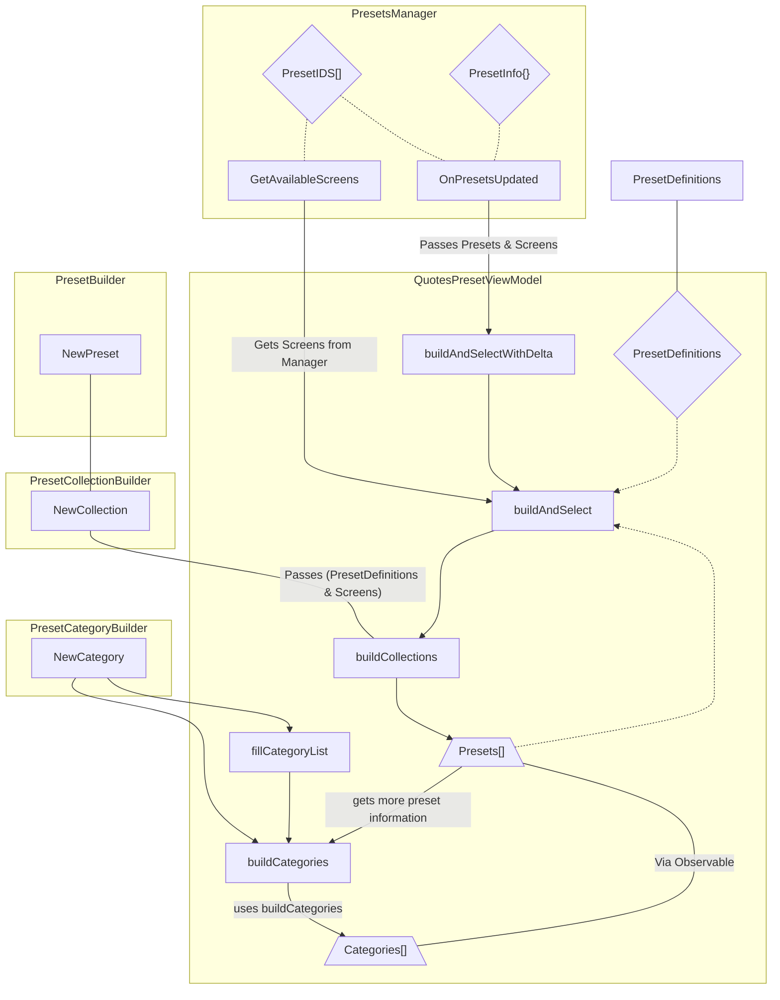

```mermaid
graph TD
    OnPresetsUpdated -- "Passes Presets & Screens" --> buildAndSelectWithDelta
    GetAvailableScreens -- "Gets Screens from Manager" --> buildAndSelect
    buildCollections --> Collections
    NewCollection --"Passes (PresetDefinitions & Screens)"--- buildCollections
    buildAndSelect --> buildCollections
    buildAndSelectWithDelta --> buildAndSelect
    Collections .-> buildAndSelect
    buildCategories --"uses buildCategories"--> Categories
    Collections --"gets more preset information"--> buildCategories
    Collections --"Via Observable"--- Categories
    NewCategory --> buildCategories
    NewCategory --> fillCategoryList
    fillCategoryList --> buildCategories
    PresetDefinitions --- PDef
    NewPreset --- NewCollection
    PDef .-> buildAndSelect
    subgraph QuotesPresetViewModel
        buildAndSelectWithDelta
        buildAndSelect
        buildCollections
        buildCategories
        fillCategoryList
        Collections[/"Presets[]"\]
        Categories[/"Categories[]"\]
        PDef{"PresetDefinitions"}
    end

    subgraph PresetsManager
        OnPresetsUpdated
        Screens .- GetAvailableScreens
        Presets{"PresetInfo{}"} .- OnPresetsUpdated
        Screens{"PresetIDS[]"} .- OnPresetsUpdated
    end

    subgraph PresetCollectionBuilder
        NewCollection
    end

    subgraph PresetCategoryBuilder
        NewCategory
    end

    subgraph PresetBuilder
        NewPreset
    end

    PresetDefinitions
```
