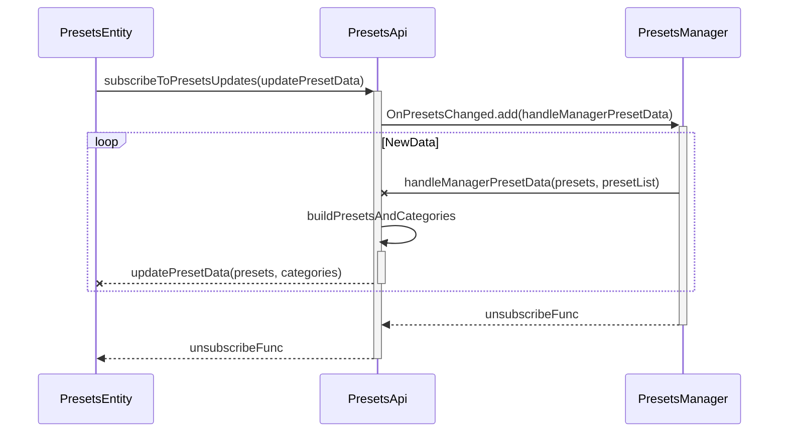

```mermaid
    sequenceDiagram
        participant PresetsEntity
        participant PresetsApi
        participant PresetsManager

        PresetsEntity->>+PresetsApi: subscribeToPresetsUpdates(updatePresetData)
        PresetsApi->>+PresetsManager: OnPresetsChanged.add(handleManagerPresetData)
        loop NewData
            PresetsManager -x PresetsApi: handleManagerPresetData(presets, presetList)
            PresetsApi ->>+ PresetsApi: buildPresetsAndCategories
            PresetsApi --x- PresetsEntity: updatePresetData(presets, categories)

        end
        PresetsManager-->>-PresetsApi: unsubscribeFunc
        PresetsApi-->>-PresetsEntity: unsubscribeFunc


```
