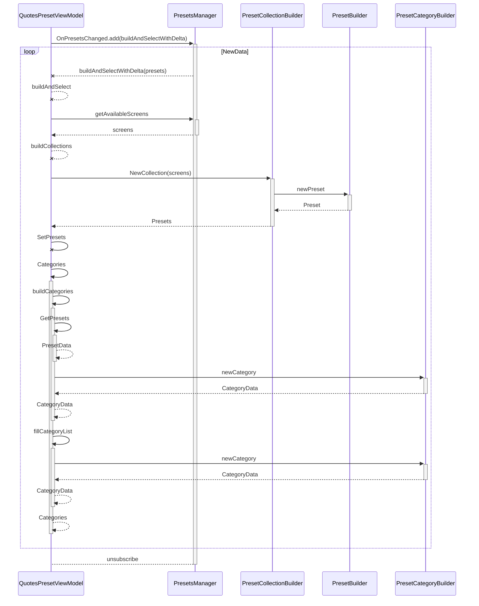

```mermaid
    sequenceDiagram
        participant QuotesPresetViewModel
        participant PresetsManager
        participant PresetCollectionBuilder
        participant PresetBuilder
        participant PresetCategoryBuilder

        QuotesPresetViewModel ->>+ PresetsManager: OnPresetsChanged.add(buildAndSelectWithDelta)
        loop NewData
            PresetsManager --x QuotesPresetViewModel: buildAndSelectWithDelta(presets)

            QuotesPresetViewModel --x QuotesPresetViewModel: buildAndSelect
            QuotesPresetViewModel ->>+ PresetsManager: getAvailableScreens
            PresetsManager -->>- QuotesPresetViewModel: screens

            QuotesPresetViewModel --x QuotesPresetViewModel: buildCollections

            QuotesPresetViewModel ->>+ PresetCollectionBuilder: NewCollection(screens)
            PresetCollectionBuilder ->>+ PresetBuilder: newPreset
            PresetBuilder -->>- PresetCollectionBuilder: Preset
            PresetCollectionBuilder -->>- QuotesPresetViewModel: Presets

            QuotesPresetViewModel -x QuotesPresetViewModel: SetPresets
            QuotesPresetViewModel ->>+ QuotesPresetViewModel: Categories
                QuotesPresetViewModel ->>+ QuotesPresetViewModel: buildCategories
                    QuotesPresetViewModel ->>+ QuotesPresetViewModel: GetPresets
                    QuotesPresetViewModel -->>- QuotesPresetViewModel: PresetData
                    QuotesPresetViewModel ->>+ PresetCategoryBuilder: newCategory
                    PresetCategoryBuilder -->>- QuotesPresetViewModel: CategoryData
                QuotesPresetViewModel -->>- QuotesPresetViewModel: CategoryData
                QuotesPresetViewModel ->>+ QuotesPresetViewModel: fillCategoryList
                    QuotesPresetViewModel ->>+ PresetCategoryBuilder: newCategory
                    PresetCategoryBuilder -->>- QuotesPresetViewModel: CategoryData
                QuotesPresetViewModel -->>- QuotesPresetViewModel: CategoryData
            QuotesPresetViewModel -->>- QuotesPresetViewModel: Categories

        end
        PresetsManager -->- QuotesPresetViewModel: unsubscribe
```
